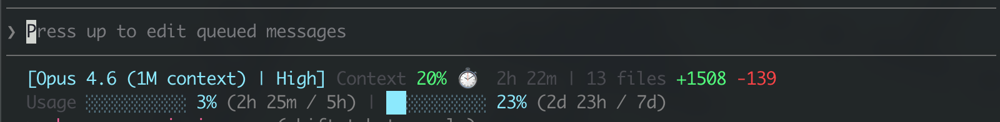
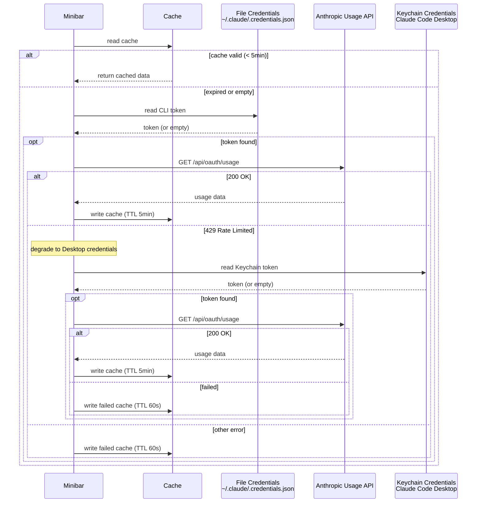

# claude-minibar

[English](./README.md) | [中文](./README.zh-CN.md)

Minimal 2-line statusline for [Claude Code](https://docs.anthropic.com/en/docs/claude-code).



## Features

- **Model & Effort** — Current model name and thinking effort level (High/Med/Low)
- **Context** — Context window usage with color coding (green → yellow → red)
- **Session Duration** — How long the current session has been running
- **File Changes** — Real-time session diff stats (files changed, lines +/-) via incremental transcript parsing
- **Usage Quota** — 5h / 7d usage with progress bars and reset countdown (Pro/Max/Team)
- **Zero Dependencies** — Pure Node.js, no build step, no external packages
- **Fast** — Incremental parsing with file-based caching; only new transcript entries are processed

## Install

In Claude Code, run:

```
/plugin marketplace add xnng/claude-minibar
/plugin install claude-minibar@claude-minibar
```

Restart Claude Code, then run the setup command:

```
/claude-minibar:setup
```

This will configure your `statusLine` in `settings.json` automatically. Restart Claude Code again to see the statusline.

## How It Works

| Feature | Data Source |
|---------|------------|
| Model name | stdin JSON from Claude Code |
| Effort level | `~/.claude/settings.json` |
| Context % | stdin `context_window.used_percentage` |
| Session duration | First timestamp in session transcript JSONL |
| File changes | Incremental parsing of session transcript JSONL |
| Usage quota | Anthropic OAuth API via macOS Keychain credentials |

## Usage Quota

Usage quota (5h/7d) requires a Pro/Max/Team subscription. API key users won't see this line.



- **Primary**: File credentials from CLI login (`~/.claude/.credentials.json`)
- **Degradation**: If API returns 429, retry with Keychain credentials from [Claude Code Desktop](https://claude.ai/download)
- **Refresh**: Success cached 5 min, failure cached 60s. Statusline re-renders on each tool call, triggering refresh when cache expires
- API key users (no OAuth login) won't see the usage line

## Requirements

- Claude Code CLI
- Node.js >= 18
- macOS (for usage quota — reads OAuth token from Keychain)

## License

MIT
