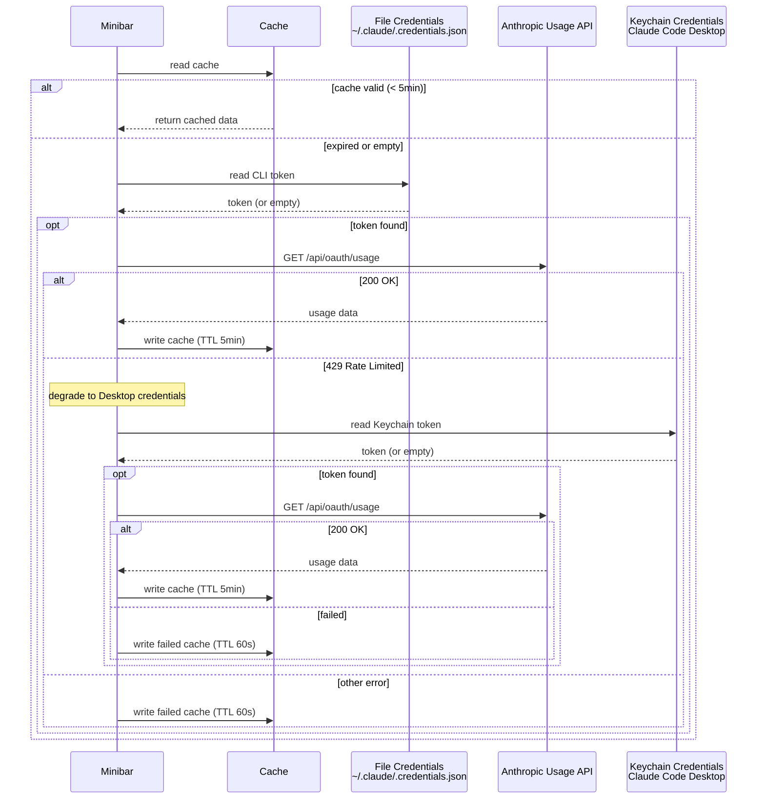
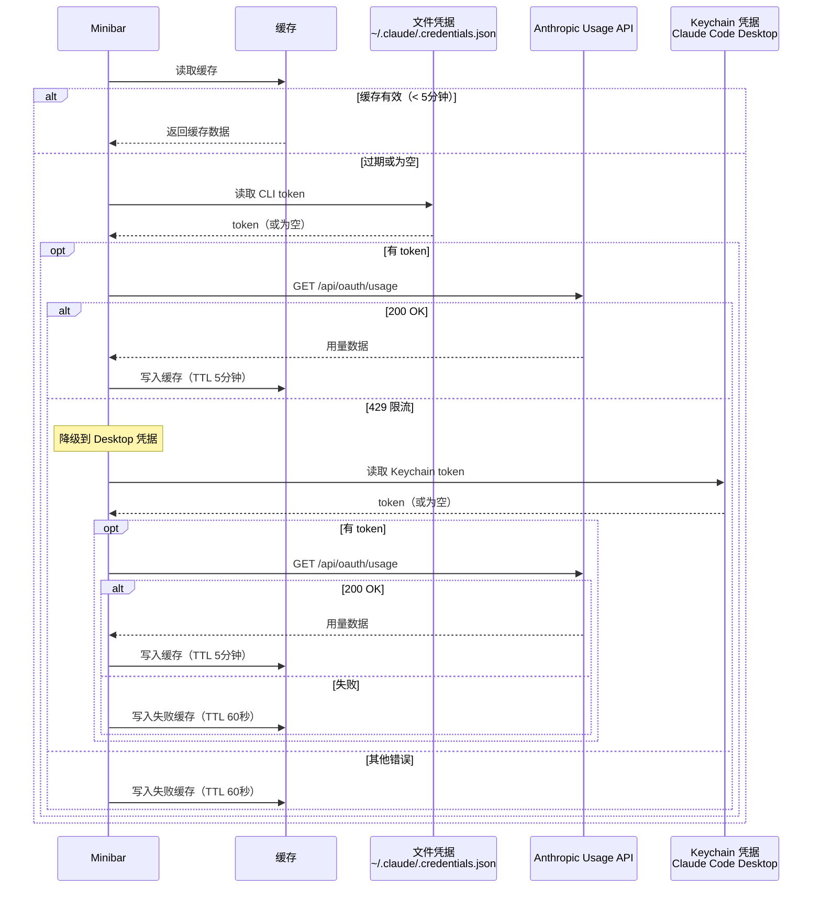

# claude-minibar

[English](#english) | [中文](#中文)

---

<a id="english"></a>

Minimal 2-line statusline for [Claude Code](https://docs.anthropic.com/en/docs/claude-code).


## Features

- **Model & Effort** — Current model name and thinking effort level (High/Med/Low)
- **Context** — Context window usage with color coding (green → yellow → red)
- **Session Duration** — How long the current session has been running
- **File Changes** — Real-time session diff stats (files changed, lines +/-) via incremental transcript parsing
- **Usage Quota** — 5h / 7d usage with progress bars and reset countdown (Pro/Max/Team)
- **Zero Dependencies** — Pure Node.js, no build step, no external packages
- **Fast** — Incremental parsing with file-based caching; only new transcript entries are processed

## Install

In Claude Code, run:

```
/plugin marketplace add xnng/claude-minibar
/plugin install claude-minibar@claude-minibar
```

Restart Claude Code, then run the setup command:

```
/claude-minibar:setup
```

This will configure your `statusLine` in `settings.json` automatically. Restart Claude Code again to see the statusline.

## How It Works

| Feature | Data Source |
|---------|------------|
| Model name | stdin JSON from Claude Code |
| Effort level | `~/.claude/settings.json` |
| Context % | stdin `context_window.used_percentage` |
| Session duration | First timestamp in session transcript JSONL |
| File changes | Incremental parsing of session transcript JSONL |
| Usage quota | Anthropic OAuth API via macOS Keychain credentials |

## Usage Quota

Usage quota (5h/7d) requires a Pro/Max/Team subscription. API key users won't see this line.



- **Primary**: File credentials from CLI login (`~/.claude/.credentials.json`)
- **Degradation**: If API returns 429, retry with Keychain credentials from [Claude Code Desktop](https://claude.ai/download)
- **Refresh**: Success cached 5 min, failure cached 60s. Statusline re-renders on each tool call, triggering refresh when cache expires
- API key users (no OAuth login) won't see the usage line

## Requirements

- Claude Code CLI
- Node.js >= 18
- macOS (for usage quota — reads OAuth token from Keychain)

## License

MIT

---

<a id="中文"></a>

## 中文

[Claude Code](https://docs.anthropic.com/en/docs/claude-code) 极简两行状态栏。


### 功能

- **模型 & 思考强度** — 当前模型名称和思考强度（High/Med/Low）
- **上下文** — 上下文窗口使用率，带颜色指示（绿 → 黄 → 红）
- **会话时长** — 当前会话已持续的时间
- **文件变更** — 本次会话的实时 diff 统计（文件数、增删行数），通过增量解析 transcript 实现
- **用量配额** — 5 小时 / 7 天用量，带进度条和重置倒计时（Pro/Max/Team）
- **零依赖** — 纯 Node.js，无需构建，无外部依赖
- **高性能** — 增量解析 + 文件缓存，只处理新增的 transcript 条目

### 安装

在 Claude Code 中执行：

```
/plugin marketplace add xnng/claude-minibar
/plugin install claude-minibar@claude-minibar
```

重启 Claude Code，然后执行 setup 命令：

```
/claude-minibar:setup
```

该命令会自动配置 `settings.json` 中的 `statusLine`。再次重启 Claude Code 即可看到状态栏。

### 工作原理

| 功能 | 数据来源 |
|------|---------|
| 模型名称 | Claude Code 通过 stdin 传入的 JSON |
| 思考强度 | `~/.claude/settings.json` |
| 上下文 % | stdin `context_window.used_percentage` |
| 会话时长 | 会话 transcript JSONL 的第一条时间戳 |
| 文件变更 | 增量解析会话 transcript JSONL |
| 用量配额 | Anthropic OAuth API（通过 macOS Keychain 凭据） |

### 用量配额

用量配额（5h/7d）需要 Pro/Max/Team 订阅。API key 用户不会显示此行。

凭据获取策略（含降级）：



- **主路径**：文件凭据，CLI 登录时写入（`~/.claude/.credentials.json`）
- **降级策略**：API 返回 429 时，使用 [Claude Code Desktop](https://claude.ai/download) 写入 Keychain 的凭据重试
- **刷新频率**：成功缓存 5 分钟，失败缓存 60 秒。状态栏在每次工具调用后渲染，缓存过期时自动刷新
- 如果持续遇到 429 错误，安装 Claude Code Desktop 可提供备用凭据源

### 系统要求

- Claude Code CLI
- Node.js >= 18
- macOS（用量配额需要从 Keychain 读取 OAuth token）

### 许可证

MIT
